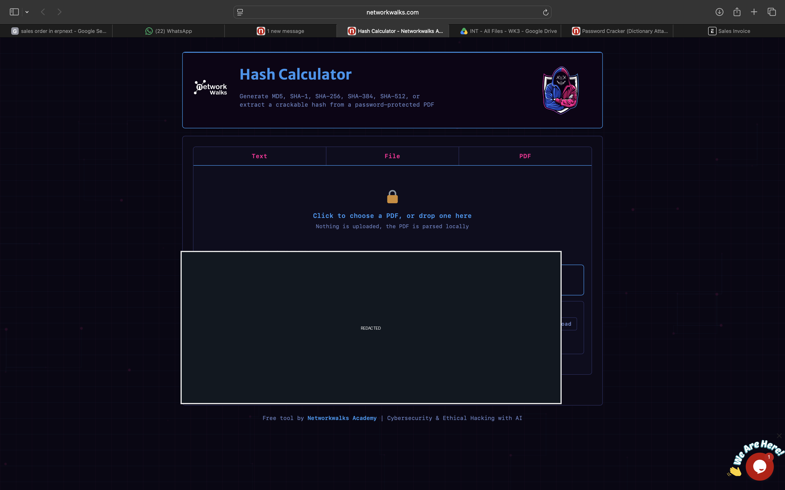
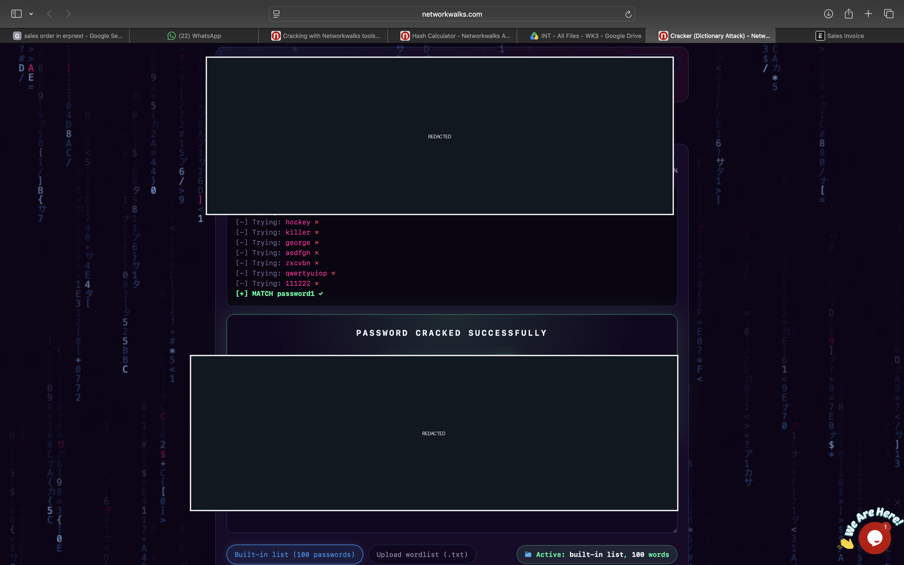
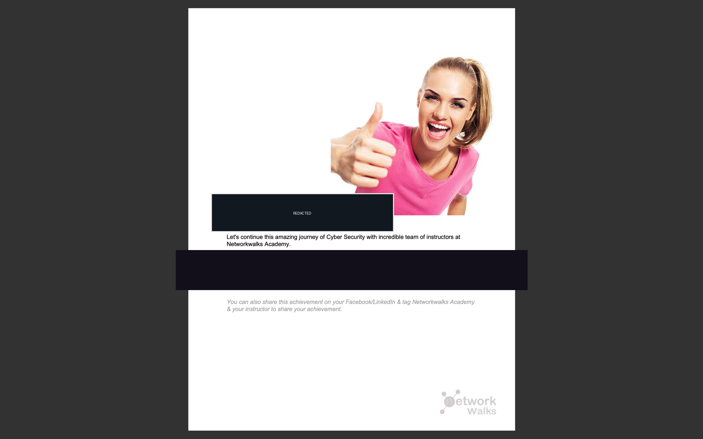
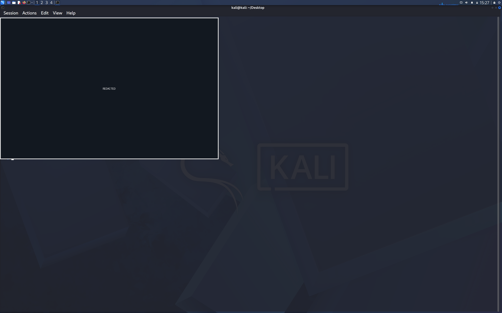
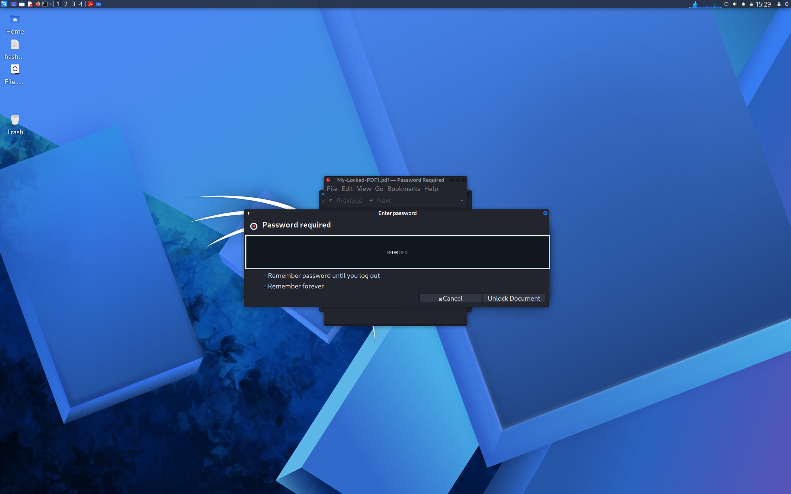

# B083 Week 3 Module 1: Password Cracking

**Evidence date:** 2026-09-25 | **Assessment type:** Authorized password-recovery exercise using an intentionally weak training PDF

## Purpose and learning goals

This lab demonstrates how a password-protected PDF can be assessed in a controlled setting. It practices extracting a password verifier, running a dictionary attack with John the Ripper (JtR) and a supplied browser-based tool, and confirming the recovered coursework password by opening the sample document.

By completing the exercise, learners can:

- distinguish an encrypted document from the password verifier used to test guesses;
- observe how offline wordlist attacks test candidate passwords without the document's interactive password prompt; and
- explain why weak, reused passwords are vulnerable and why longer, unique passphrases are preferable.

## Scope and authorization

The work was limited to the supplied `My-Locked-PDF1.pdf` coursework sample and a controlled Kali Linux virtual machine. The sample was used only for this authorized exercise. No real credentials, personal accounts, third-party files, or unrelated systems were tested. Do not submit real or confidential documents to online hash-extraction or cracking services.

## Tools and setup

- Kali Linux virtual machine
- John the Ripper / Johnny, available in Kali
- [NetworkWalks Hash Calculator](https://networkwalks.com/hash-calculator/)
- [NetworkWalks Password Cracker](https://networkwalks.com/password-cracker/)
- The supplied password-protected training PDF

The browser tools were used only with the supplied training sample. The report intentionally omits the extracted hash, recovered password, and training flag.

## Workflow

### John the Ripper in Kali

1. Use an authorized PDF hash-extraction utility to extract the verifier from the sample PDF and save it to a local text file.
2. Load that file in John the Ripper or its Johnny graphical interface.
3. Run a wordlist attack using the lab's permitted wordlist, then review the completion status without publishing the recovered value.
4. Enter the recovered coursework password in the PDF viewer to confirm that the supplied document opens.

### NetworkWalks browser tools

1. Select the supplied PDF in the Hash Calculator and extract its verifier.
2. Pass the sample's extracted verifier to the Password Cracker and run its built-in dictionary attack.
3. Use the recovered lab password to unlock the same supplied PDF and confirm the intended training outcome.

## Results

The PDF hash extraction succeeded. The supplied built-in dictionary recovered the intentionally weak coursework sample password. John reported one PDF-MD5 hash loaded and completed the wordlist session. The PDF then unlocked to the intended training flag screen. Secret values are excluded from this report and redacted from the published screenshots.

## Security takeaways

A password hash is a verifier used to check password guesses; it is not the encrypted document and is not a way to decrypt it. Hashing is distinct from encryption: a hash is designed as a one-way representation, while encryption protects data that can be recovered with the correct key or password.

When an attacker obtains a verifier, offline wordlist attacks can test guesses without being constrained by an application's login rate limits. A weak password that appears in a candidate list can therefore be recovered quickly. Use long, unique passwords or passphrases, store them in a reputable password manager, enable multi-factor authentication where available, and enforce rate limits and monitoring on online authentication systems. Rate limits help protect online logins but do not stop offline guessing against a stolen verifier.

## Limitations

- This was one intentionally weak training PDF, not a test of real users' credentials or production systems.
- The browser exercise used a tiny, supplied dictionary; the result describes this specific sample and run only.
- No conclusions are made about the resilience of real-world passwords, other hash formats, or other cracking tools.
- The exercise did not test account authentication, online rate limits, or defenses on any external service.

## Evidence gallery

The six screenshots below are stored in the repository root and displayed inline in workflow order. Secret values were visibly redacted from the derivatives before publication; the supplied source captures were left unchanged.

### 1. Hash Calculator extraction

NetworkWalks Hash Calculator processing the supplied PDF; the extracted verifier area is redacted.

### 2. Built-in dictionary result

NetworkWalks Password Cracker dictionary workflow; verifier and password/result areas are redacted.

### 3. Browser training result

The browser-based training outcome; flag value is redacted.

### 4. John the Ripper session

Kali Linux wordlist-session evidence; terminal output is redacted to protect any embedded values.

### 5. Kali PDF password prompt

The supplied PDF's unlock prompt; the password-entry area is redacted.

### 6. Training result in Kali

The unlocked training document's result screen; flag value is redacted.

## Conclusion

The exercise showed that a weak password protecting a training PDF can be recovered from its verifier with a supplied wordlist, then used to open the document. It illustrates why password strength and protecting stored verifiers matter, while making no claims beyond this deliberately limited coursework sample.
